# STM32 Nucleo-F411RE and MicroPython Getting Started  

These instructions build the firmware and uses the __.hex__ file to flash to the board using the ST-Link on the board and the ST-Link Utility, no hardware hacking required.
These instructions may also work with the following _Nucleo 64_ boards (ST reference: MB1136):  

- Nucleo-F091RC  
- Nucleo-F401RE  
- Nucleo-F411RE (obviously) (Tested and working)  
- Nucleo-F446RE  
- Nucleo-L073RZ  
- Nucleo-L452RE  
- Nucleo-L476RG  
- And possibly others found in the /micropython/ports/stm32/boards direrectory which is explained later on.  

This guide assumes a basic general knowledge of computers, programming, software issue handling, working with Electronics and microcontrollers. I will shorten microcontroller to MCU.  

## Index for this README/Guide  

[Software Requirements](#Software-Requirements)  
[Get the Board Ready](#Getting-The-Board-Ready)  
[Build the Firmware](#Build-The-Firmware)  
[Donwload the Firmware](#Donwload-the-Firmware)  
[Test MicroPython](#Test-MicroPython)  
[Upload Python Files](#Upload-Python-Files)  
[Useful Links](#Useful-Links)  
[Pinouts](#Pinouts)  
[Contributing](#End)  

## Software Requirements  

Most of the other guides on the Internet explains how to program and flash the MicroPython on a Linux based development system. This made it difficult for me to get it working on a Windows based system, hence Why I made this guide to help other people who wants to get started on a Windows based environment.  
The specific environment this was tested on was Windows 10 Enterprise 64 Bit.  

Many of the other guides also shows how to upload by bypassing the ST-Link on the Nucleo board. This is because the ST-Link on the Nucleo board actually connects serially to the MCU and not using USB as in the boards like the Adafruit Feather etc. The Adafruit Feather and many other boards has a onboard USB port which when you connect via the micro USB connector to your PC, it will actually show a "drive" which is a portion of the flash memory of the MCU. This is why in these cases you can see the __boot.py__ , __main.py__ and other micropython files directly on the MCU in these cases versus NOT in the Nucleo-F411RE case.  

The following software is required and needs to be downloaded and installed, if not already:  

1. Python version 3.4 or later (I tested with version 3.8.1)  
2. STM32 ST-Link Utility (Mine was version 4.5.0)  
3. Arm-none-eabi-gcc development environment (I used version 10.1.0)  
4. MinGW, I am not sure which version it was, the installer downloaded the newest version. Just download the newest version. This is used to run the __make__ utility so you could use another building package as well, something like [CMake](https://cmake.org/).  
5. Adafruit's ampy tool.  
6. The MicroPython repository, I got version 1.13-46-g85f2b239d at the time of doing this.  

I really did not do any research on which versions to use with what versions. I just used the most recent versions I could find and install if it was not already installed on my computer.  
I do however recommend to use stable release versions for obvious reasons.  

### Install Python  

1. Head over to [python.org](https://www.python.org/) the official Python website.  
2. There is a __Download__ menu option, as soon as you hover over it, it will bring up a submenu and a panel with the download for your system.   
3. Click on the button and it will download the Python installation executable. Install Python by going through the prompts. I usually prefer to install it in a directory directly under my c: drive and I name this directory _"Python"_, thus under __c:\Python__.  
4. Make sure to select the add Python to path. If you forgot, just add the installlation directory under your [Environment Variable PATH](#How-To-Add-Environment-Variables-PATH-entries) Variables.  
5. you can now open a command prompt and type ```python --version``` or ```py --version``` and it should return the Python version for you. When you type ```python``` or ```py``` and enter you will get the REPL Python Interpreter.  

### Install the ST-Link Utility  

1. Go to the [ST Microelectronics](https://www.st.com/content/st_com/en.html) website and search for ST-Link Utility, click on the [STSW-LINK004](https://www.st.com/content/st_com/en/products/development-tools/software-development-tools/stm32-software-development-tools/stm32-programmers/stsw-link004.html) product link and download the utility by clicking on the "Get Software" link. 
2. Note that you will need to register for a ST site user account which is free and does not take too long.  
3. Exctract and run the installer which will install the utility as well as some device drivers which will be used when connecting via USB to the STLink boards.  
4. When you are done there should be a new shortcut on your desktop __STM32 ST-Link Utility__.  

### Install the Arm-none-eabi-gcc toolchain  

> Note that other versions of the Arm-none-eabi-gcc toolchain would also be acceptable to install if preferred.  

1. Download the toolchain from the [Bleeding-Edge-Toolchain download site](https://freddiechopin.info/en/download/category/11-bleeding-edge-toolchain), the link that I got was [this one](https://freddiechopin.info/en/download/category/11-bleeding-edge-toolchain?download=187%3Ableeding-edge-toolchain-200517-32-bit-windows) which will start a download of a _*.7z_ archive, mine had the name "arm-none-eabi-gcc-10.1.0-200517-win64". 
> You may need to install a unzip utility which can unpack 7Z compressed files, I use the 7-Zip utility which is small and free  
2. Extract the files and then copy it over to a suitble directory. I copied it into my _**e:\dev** directory underneath the name "arm-none-eabi-gcc-10.1.0-200517-win64". Make sure there is no spaces in any of these directories. (This is also a good practise for any mcu related development)  The directory will look like this:  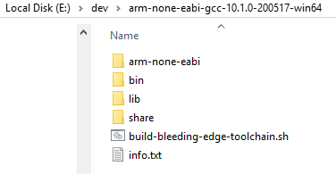  
3. Add the following two directories to your path (depending on where you installed the toolchain) 
- E:\dev\arm-none-eabi-gcc-10.1.0-200517-win64
- E:\dev\arm-none-eabi-gcc-10.1.0-200517-win64\bin
  

[How to add Environment Variable PATH entries](#How-To-Add-Environment-Variables-PATH-entries)  
4. Open a new command prompt and test by typing ```arm-non-eabi-gcc --version``` and you should see the version number, if not, your environment path variable did not take effect.  

### Install MinGW  

> You can also install or use another type of build utility like [Ninja Build](https://ninja-build.org/)  

1. Go to the [MinGW website](http://www.mingw.org/) and at the top right, click on the "Downloads" link.  
2. Just abovee the "Download Package List" there is a executable that you can [download for Windows](https://osdn.net/projects/mingw/downloads/68260/mingw-get-setup.exe/). Click on that to download the executable. (mingw-get-setup.exe)  
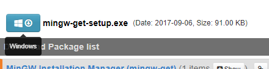
3. Run this executable and follow the prompts to install the MinGW envioronment.  
4. I installed it under __c:\MinGW__ which will end up looking like this:  
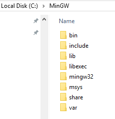

### Install Adafruit Ampy tool  

1. Open up a new command prompt window.  
2. Type ```pip install adafruit-ampy```  
3. This will install the ampy toolset on your system.  
4. Type ```ampy --help``` to test if the installation was successful.  

> Obviously you would need Python to be installed first before doing these steps.  

### Install the MicroPython Repository  

1. Go to the [MicroPython Github Repository](https://github.com/micropython/micropython) and download the entire repository.  
You can do this by cloning it with git if you know how or by downloading it as a zip file by clicking on the green button and then the "download zip".  
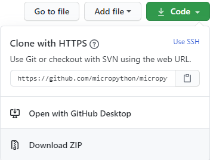  
2. Extract it to a directory of your choice, I extracted it to __e:/dev/micropython__ which looks like this:  
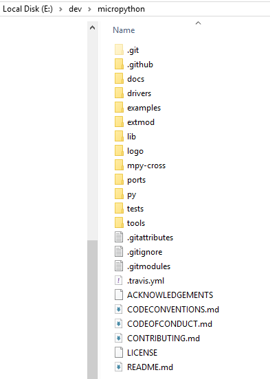  

### Special NB!  

1. Go to your Python installation directory and make a copy of __python.exe__, name it __python3.exe__ . This is an important steps for us Windows users. The firmware will not build because it is looking for a python3 executable which exists normally on Linux, but not on Windows.  
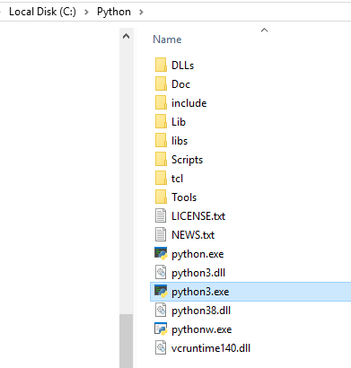  

All the required software will now be installed.  

> It is also recommended that you get some sort of terminal program which will be used later on to access the REPL on the MCU, it is however not a prerequisite to be able to get your files onto the MCU, but nice to test. In the older days Wondws had the Hyper Terminal, but you can also use [PuTTY](https://www.putty.org/) or [TeraTerm](https://ttssh2.osdn.jp) or any other terminal program that you know or prefer to use.

### How To Add Environment Variables PATH entries  

1. Click on the start button (or press the Windows key) then start to type ```Environment Variables``` on the windows menu the Environment variables links will appear like this:  
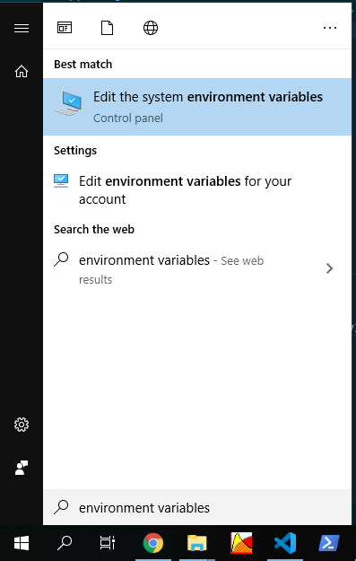  
2. Click on the __Edit the System Environment Variables__ link on the start menu.  
3. The systems properties window will appear, at the bottom, click on the __Environment Variables..._ button.  
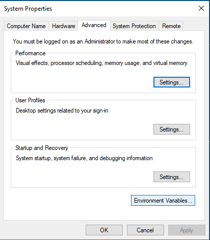  
4. Select the __Path__ under __System variables__ then click on __Edit__.  
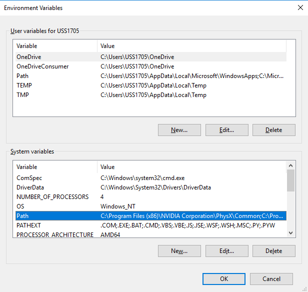  
5. Add a directory to the path by clicking on the __New__ button and pasting the directory just like the exampples already in the list. When done you can close all the dialogs.  
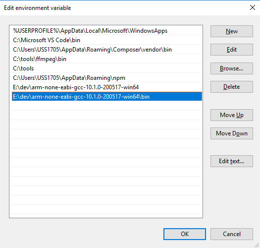  

## Getting The Board Ready  

You will need:  

- The Nucleo-F411RE development board.
- A micro USB cable connected to a USB port on your computer.

1. Make sure all jumpers is set to their default settings on the board. Thus CN2 must have two jumpers next to one another (NUCLEO), JP6 (IDD) must have a jumper and JP5 must have a jumper towards the U5V side. No other jumpers or pins need to be "jumped" or connected. (Only at the bottom there are two jumpers on either side, these are just palce holders and you can use these two jumpers if you need jumpers)  
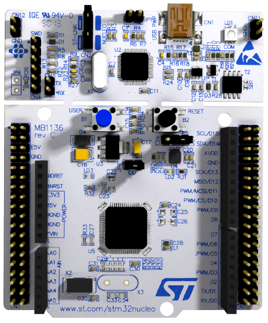  
2. Connect the micro USB cable to the board and see that the board power up, two or more LEDs will lit up and your computer will install the device drivers then open up a "thumb drive" via explorer. If this happens then you have connection.  

## Build the Firmware  

1. On your computer using file explorer, go to the MinGW installation folder ```c:\MinGW``` on my computer. Then go to the ```msys\1.0``` sub directory.  
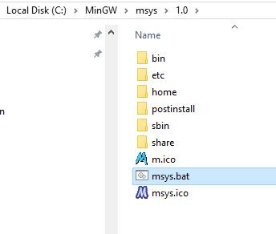  
2. Double click on the __msys.bat__ file to open up a Bash Command Window.  
3. In this Bash window, change your directory to the micropython directory, ```cd e:/dev/micropython```  
> Note that in Bash the directory seperator is different direction from the standard command prompt "/" instead of "\".  
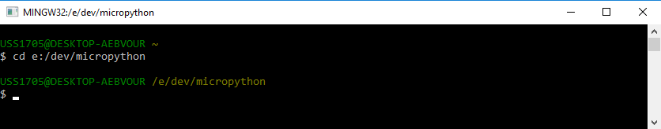
4. Now type ```make -C mpy-cross``` It will build some files and then it will finish with an error, My experience is to ignore this error, everything works with this error.  
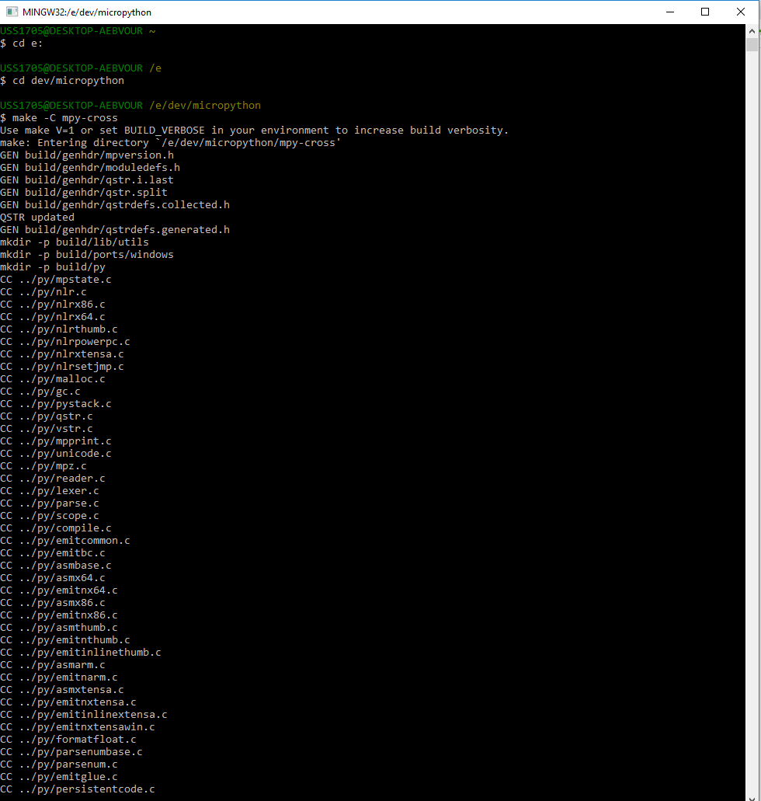  
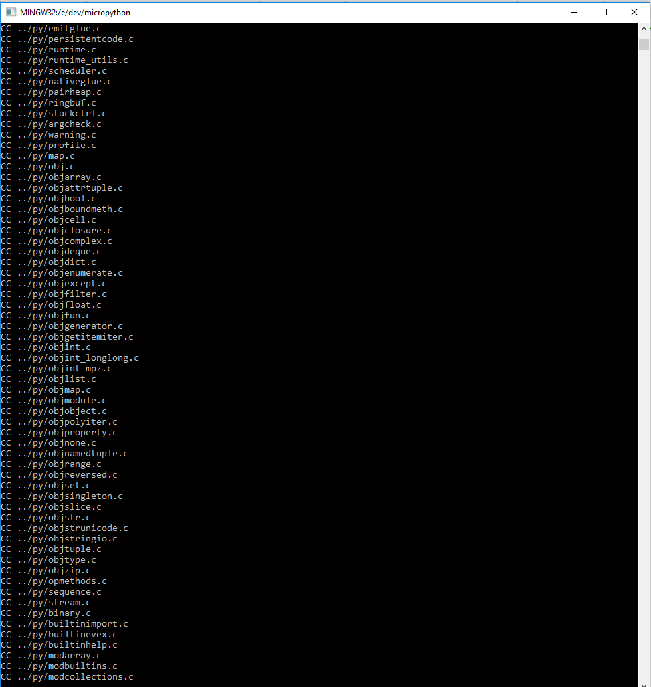  
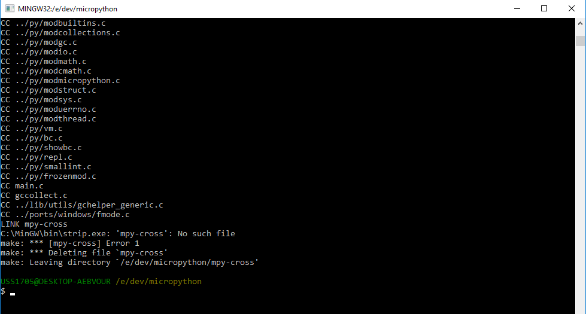  

5. Change directory to the STM32 sub directory ```cd ports/STM32```  
6. Now type ```make submodules```  
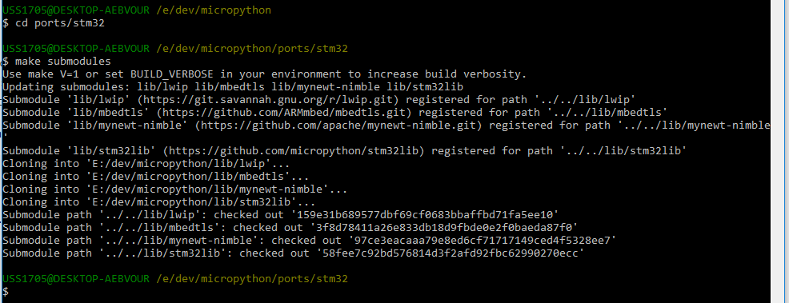  
>Steps 4 and 6 only have to be performed once when you install micropython, thereafter only the required MCU board is build when needed.  
7. Now we can build the required firmware by typing ```make BOARD=NUCLEO_F411RE```  
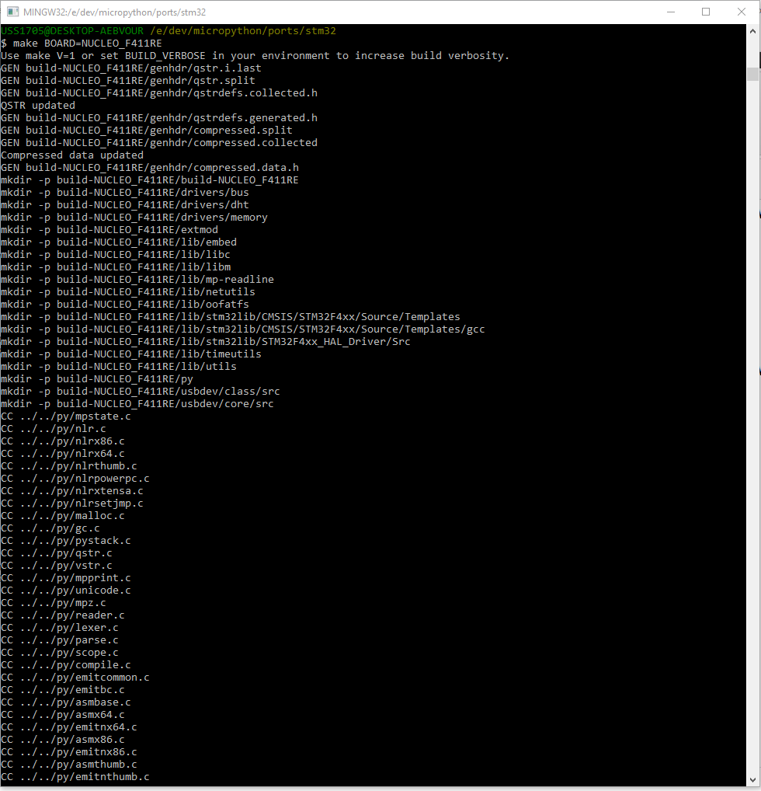  
  
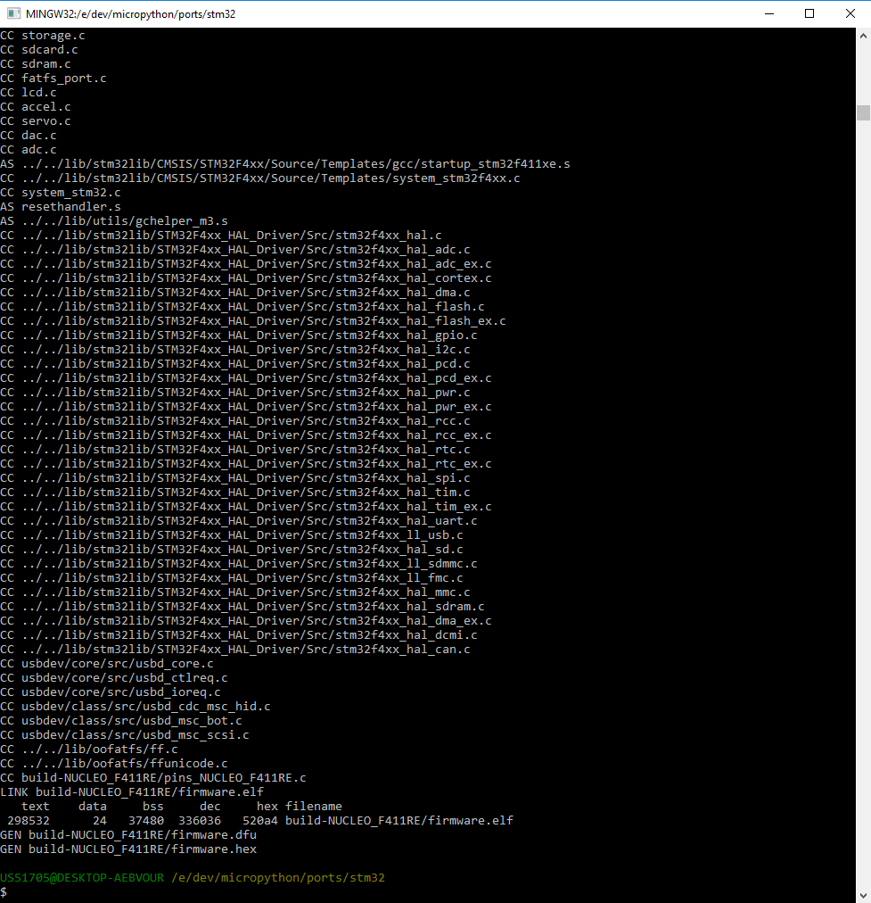  
8. The firmware is now built and a directory containing all the files can be found under the ```e:\dev\micropython\ports\stm32\``` directory. This will be named as __build-NUCLEO_F411RE__ 
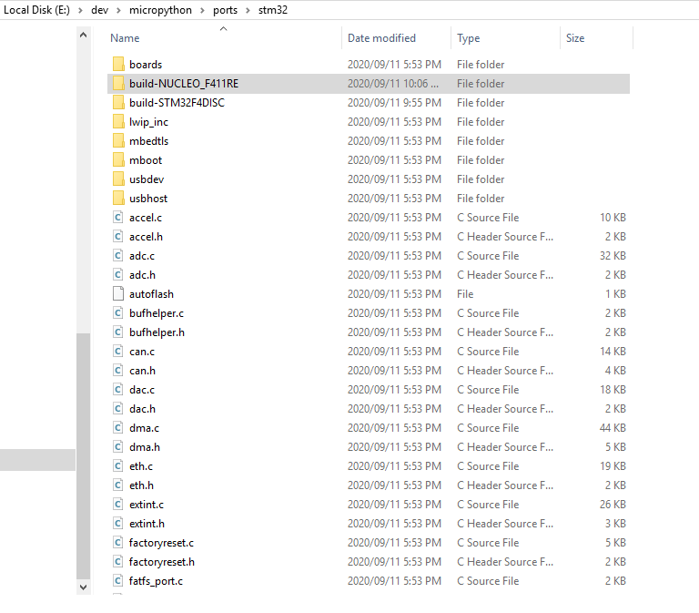  
9. You can now close/exit the Bash window.  

## Donwload the Firmware  

1. With your board connected to your computer via the micro USB cable, open up the ST-Link Utility.  
2. In the menu, click on __Target__ then __Connect__  
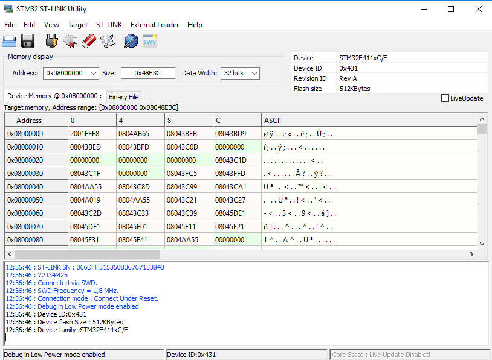  
3. Go to __File__ then __Open File__ and select the __firmware.hex__ file.
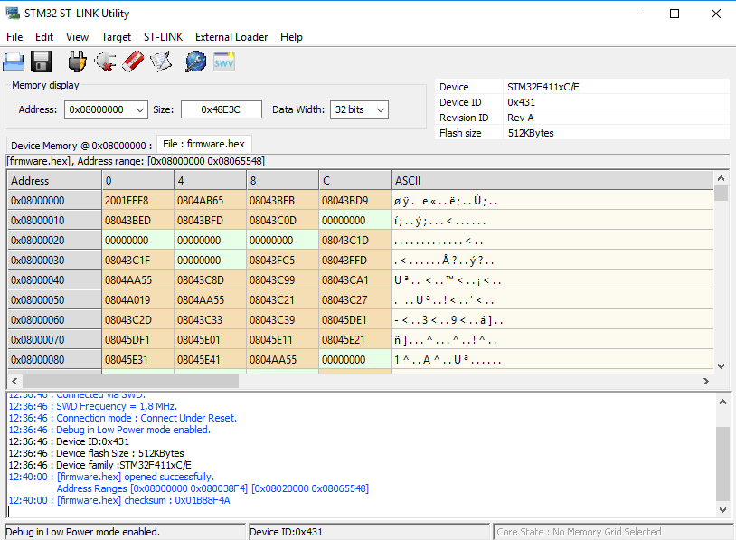  
4. Click on __Target__ then __Program and Verify__ then click on the __Start__ button.  
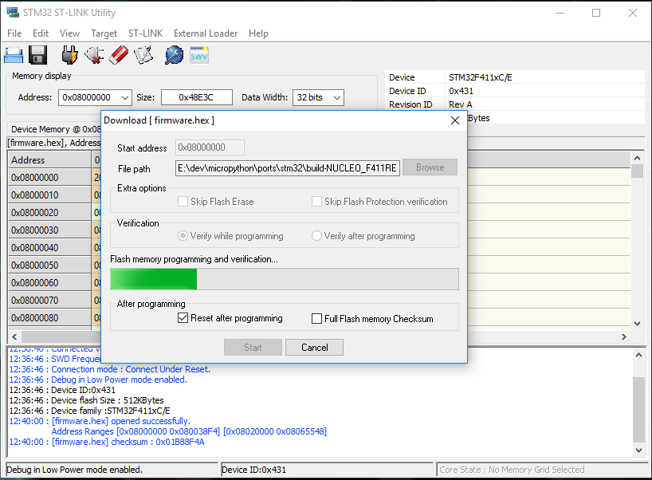  
5. The Nucleo-F411RE is now programmed and the ST-Link LED will falsh fast. You can now disconnect the device from ST-Link Utility and clos it. Then safely remove the USB drive then unplug and replug the board.  
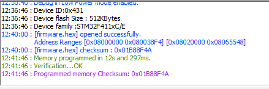  

Congratulations! MicroPython is now loaded onto the Nucleo-F411RE board.  
Lets test it now.  

## Test MicroPython  

1. Connect your board then open up your favorite Terminal Program and setup your serial connection as follow:  

    - Com port: Usually something higher, just look, you will identify it easily.  
    - 115200, 8 bit, no parity, 1 stop bit, no flow control.  
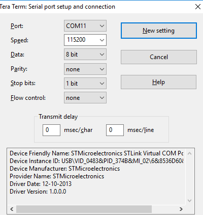  
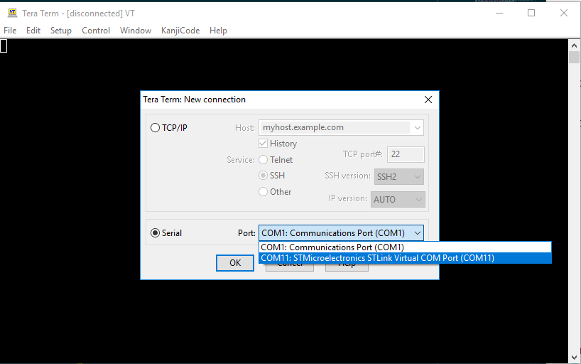  

2. You will now be presented with the Python REPL interpreter.  
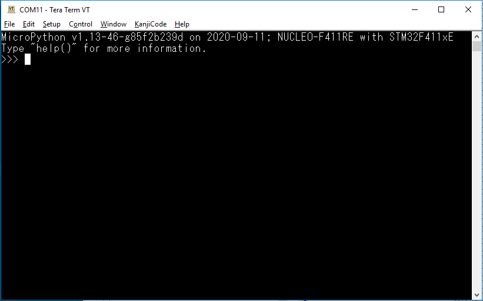 
3. If it does not show you the interpreter like above, then you will have to reset the device by following these steps:  
    - First with board powered on and cable connected and terminal program connected as above, press both the __User__ (blue) and __Reset__ (black) swithes and hold.  
    - Now release the __Reset__ switch. The green LED will flash once then a pause then flash twice then a pause then flash three times then a pause and then the sequence will repeat. When the thrid flash ends, at that moment release the blue switch too.  
    - The Green LED will then give about four quick flashes then goes off.  
    - The REPL should now be visible in your terminal program.  
4. We can now test if Python is working by trying out some common Python oneliners.  
    - ```1 + 1``` then ```Enter``` should give the integer two in the next line.  
    - ```print('Hello')``` then ```Enter``` should give the string Hello in the next line.  
    - more elaborate example:
    ```
    from pyb import LED
    led = LED(1)
    led.toggle()
    led.off()
    led.on()
    ```
    - 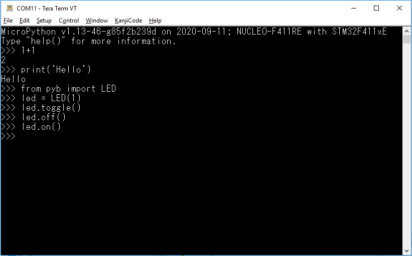  
5. If all that worked you should have seen the LED goes on and off as we do some of the commands. Congrats, this means Python is working on our MCU.  

## Upload Python Files  

1. Create a project directory where you will add your main.py and boot.py files.  
2. Create a file called ```main.py``` and edit the file with the following code which will be our blink the user LED code:  

    ```Python
    from pyb import LED
    import time

    led = LED(1)

    while True:
        led.toggle()
        time.sleep(1)
    ```

3. Open up command prompt and change dirtectory to this project directory. Your board should still be connected and powered on.  
4. Remembering the previous COM port number, type the following ```ampy -p COM11 ls``` (Just use the right com port number) This should return ```/flash``` which means that the main.py and boot.py is under the /flash directory on the MCU "drive".  
5. If you type ```ampy -p COM11 get main.py``` it will print out the contents of the main.py file (the default one at this stage) on the MCU.  
6. Now we upload our edited main.py by typing the following command ```ampy -p COM11 put main.py``` The user LED will flash fast as the file is uploaded. You can now press the __Reset__ button to restart the board and run the user code.  
7. The green user LED will now flash at a rate of one second on and one second off.  
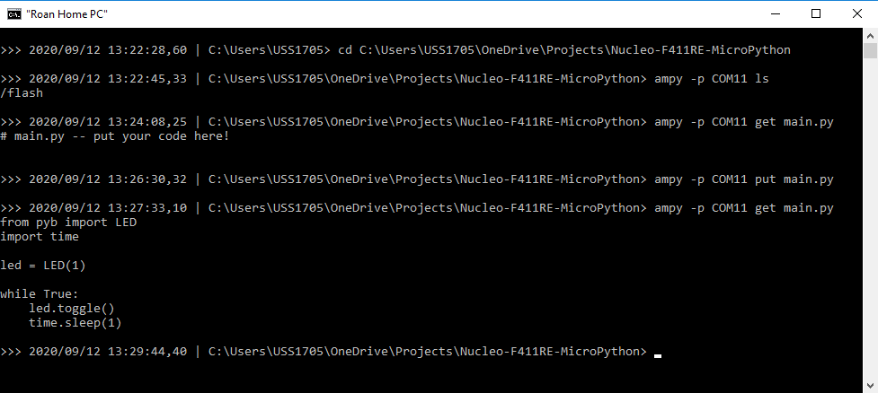  

Congratulations! We have written our first program which is now running. 

The MicroPython documents is really helpful to get you started, be sure to check it out on the MicroPython website.  

## Useful Links  

[STM32 Nucleo Basic User Manual](https://files.amperka.ru/datasheets/nucleo-usermanual.pdf)  
[MicroPython - Github Repository](https://github.com/micropython/micropython)  
[MicroPython - Documents Online](http://docs.micropython.org/en/latest/)  
[Pre-Compiled DFU firmware Files](https://micropython.org/download/all/)  
[Bleeding Edge Arm Toolchain](https://distortos.org/documentation/arm-toolchain-windows/)  
[Safe mode and factory reset](https://docs.micropython.org/en/latest/pyboard/tutorial/reset.html)  
[MicroPython Forums](https://forum.micropython.org/)  
[Alternate way to load MicroPython](https://www.tombroughton.me/blog/micropython-on-stm32nucleo/)  
[Library pyb, the class Pin](http://docs.micropython.org/en/latest/library/pyb.Pin.html#pyb-pin)  
[MicroPython vs CircuitPython plus Great links](https://www.digikey.co.za/en/maker/projects/micropython-basics-what-is-micropython/1f60afd88e6b44c0beb0784063f664fc)  

## Pinouts  

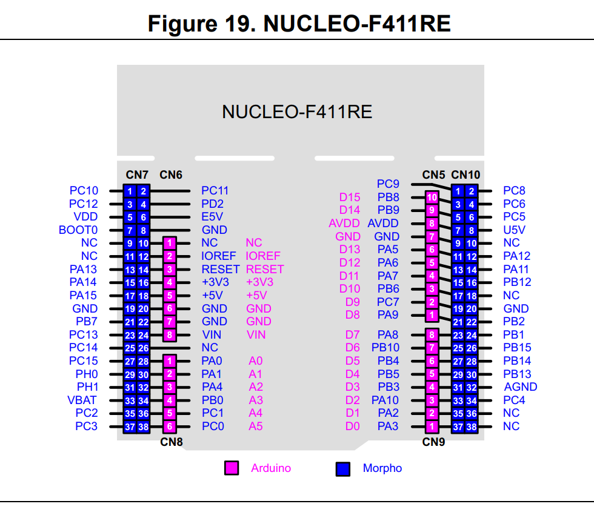  

  

## FAQ  

1. __Why do I not see the main.py, boot.py and other default MicroPython files in the drive when I connect the board?__  
A: The drive that you see with the files is the MBED storage on the ST-Link onboard programmer and NOT the MCU flash. Other development boards like the Arduino Feather exposes the USB from the MCU which maps the flash memory where you can see these files, but not on this Nucleo-F411RE board.  

2. __Cats or Dogs?__  
Dogs, always...

## End  

This guide was made available for free by me. You are welcome to get in contact with me to fix errors, update, add or change something to this guide.  
roanfourie@gmail.com  